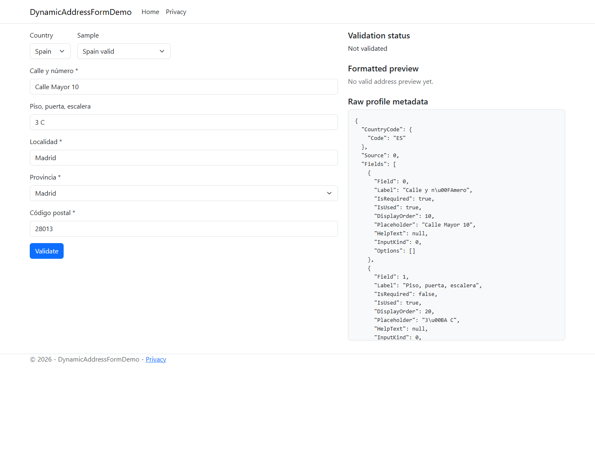

# DynamicAddressFormDemo

Razor Pages POC for a back-office address entry screen that changes fields based on `IAddressProfileProvider` metadata.

## Countries

Uses Spain, France, and Ireland. Spain demonstrates select-style administrative areas; France and Ireland demonstrate freer text administrative-area behaviour.

## Run

```bash
dotnet run --project ExtendedTestRigs/DynamicAddressFormDemo --urls http://localhost:5001
```

Open `http://localhost:5001`.

## Screenshot



## Features exercised

- Profile-driven field order, labels, required flags, placeholders, and input kind.
- Select options for Spanish provinces.
- Free-text administrative areas for France and Ireland.
- Posting the generated form back through country-specific validation.
- Field-level validation issue display.
- Valid and invalid sample addresses loaded from the UI.

## Known limitations

- The form uses a small local mapping layer from profile fields to the library's `Address` constructor.
- Only the fields represented by the core `Address` model can be posted.
- The page shows raw profile JSON for debugging, not as polished UX.
